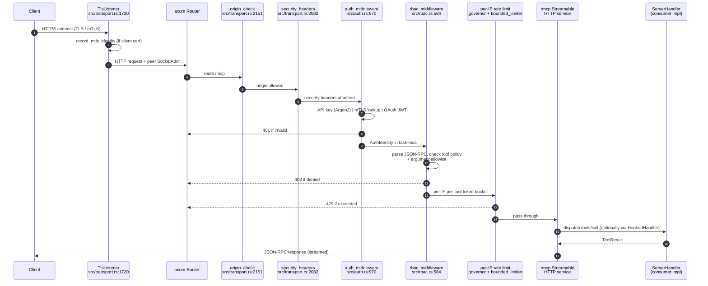
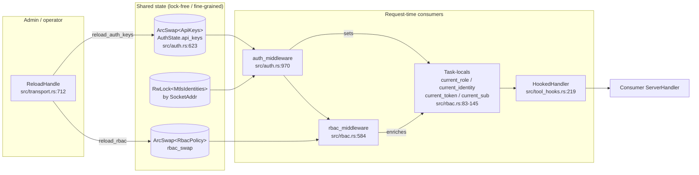
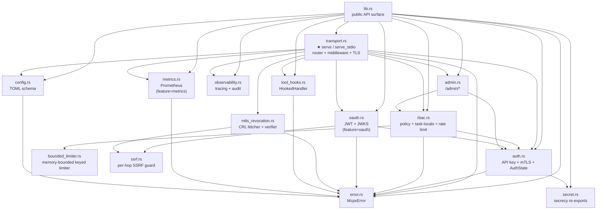

# rmcp-server-kit — Project Mindmap

> Visual map of the `rmcp-server-kit` crate. Pair with [`AGENTS.md`](../AGENTS.md) and
> [`ARCHITECTURE.md`](ARCHITECTURE.md). All file:line references use the
> code as of `rmcp-server-kit` 1.3.1.

---

## High-level mindmap

```mermaid
mindmap
  root((rmcp-server-kit<br/>1.3.1))
    Identity
      Library crate
      No src/main.rs
      Edition 2024
      MSRV 1.95.0
      Dual MIT / Apache-2.0
      Repos
        GitHub andrico21/rmcp-server-kit
        crates.io rmcp-server-kit
    Purpose
      Reusable framework
      MCP servers in Rust
      Streamable HTTP transport
      Wraps rmcp 1.5
      Consumers supply ServerHandler
    Modules src/
      lib.rs
        Crate root
        Re-exports public API
      transport.rs ★
        serve fn ~L1275
        serve_stdio fn ~L2241
        McpServerConfig L73-355
        impl McpServerConfig L359-700
        ReloadHandle ~L712
        build_app_router ~L810
        TlsListener ~L1720
        shutdown_signal ~L2018
        origin_check_middleware def ~L2151 / wired ~L1228
        security_headers_middleware def ~L2082 / wired ~L1115
      auth.rs
        AuthIdentity L40-58
        AuthState struct L621
        AuthState.api_keys L623
        Argon2 hashing
        auth_middleware ~L970
      rbac.rs
        RbacPolicy L329
        ArgumentAllowlist L226
        RoleConfig L174
        Task-locals L83-145
          current_role
          current_identity
          current_token
          current_sub
        rbac_middleware L584-700
        enforce_tool_policy L701
        build_tool_rate_limiter L53
      bounded_limiter.rs
        BoundedKeyedLimiter L93
        Memory cap + LRU prune
        Backs RBAC per-IP/per-tool limiter
      oauth.rs feature=oauth
        OAuthConfig::validate L390
        JwksCache impl L878
        JwksCache::validate_token L974
        JwksCache::validate_token_with_reason L984
        select_jwks_key L1075
        refresh_with_cooldown L1185
        JWKS_REFRESH_COOLDOWN ~L853
        JWKS key cap (fail-closed default 256)
        Discovery endpoints
        OAuth proxy routes
      ssrf.rs
        Per-hop SSRF guard
        scheme/userinfo/IP-literal blocks
        Used by JWKS, CRL, OAuth proxy fetches
      mtls_revocation.rs
        CrlSet L95
        note_discovered_urls L348
        DynamicClientCertVerifier L736
        bootstrap_fetch L889
        run_crl_refresher L981
      tool_hooks.rs
        HookedHandler L219
        impl HookedHandler L240
        before_call hook
        after_call hook
        Result-size cap
      admin.rs
        require_admin_role L133
        admin_router L160
        /admin/* router
        Diagnostics
        Admin role gated
      observability.rs
        init_tracing_from_config L39
        init_tracing L118
        JSON logs
        Audit-file sink L170
      metrics.rs feature=metrics
        McpMetrics L26
        serve_metrics L95
        Prometheus registry
        /metrics listener
        Recording middleware
      config.rs
        TOML schema
        Validation
      error.rs
        McpxError
        IntoResponse mapping
      secret.rs
        secrecy re-exports
    Endpoints
      Open
        /healthz
        /version
      Conditional
        /readyz
        /metrics feature=metrics
        /.well-known/oauth-* feature=oauth
      Admin gated
        /admin/*
      Authenticated
        /mcp rmcp service
    Auth modes
      API key
        Bearer token
        Argon2 hash compare
        ArcSwap hot reload
      mTLS
        TlsListener captures cert
        Keyed by SocketAddr
        x509-parser CN/SAN
        CDP-driven CRL revocation
          Auto-discover from CA chain + client certs
          reqwest fetcher + in-memory cache
          nextUpdate refresh clamped 10min..24h
          Hot-swap verifier via ArcSwap
          Fail-open default; fail-closed opt-in
          SSRF guard
            scheme allowlist http/https only
            userinfo rejected
            private/loopback/link-local/metadata IPs blocked
            redirect=none for CRL traffic
            crl_max_concurrent_fetches default 4
            crl_max_response_bytes default 5 MiB
            crl_discovery_rate_per_min default 60
            commit-after-admission ordering
      OAuth 2.1 JWT
        JWKS verify
        Cache + cooldown
        Feature gated
        OauthHttpClient
          with_config preferred
          new deprecated
          HTTPS to HTTP redirect rejected
          HTTP to HTTP gated by allow_http_oauth_urls
          Hardening
            OAuthConfig::validate rejects userinfo and literal IPs across all 6 URL fields incl. issuer
            Per-hop range-based redirect-target guard on OauthHttpClient and JwksCache redirect closures
            JwksCache key cap fail-closed default 256
            Closures stay sync no async DNS
    Middleware order
      outer to inner
      1 Origin check
      2 Security headers
      3 CORS
      4 Compression
      5 Body size cap
      6 Timeouts
      7 Concurrency cap optional
      8 Metrics optional
      9 Auth
      10 RBAC
      11 Per-IP tool rate limit
      12 rmcp StreamableHttpService
    State plane
      ArcSwap lock-free
        AuthState.api_keys
        rbac_swap RbacPolicy
      RwLock
        MtlsIdentities by SocketAddr
      Task-local
        Set by middleware
        Read by tool handlers
        Does NOT cross spawn
    Hot reload
      ReloadHandle
        reload_auth_keys
        reload_rbac
      No restart needed
      Eventually consistent
    Cargo features
      oauth off-default
        jsonwebtoken
        reqwest
        urlencoding
      metrics off-default
        prometheus
    Tech stack
      Async tokio 1
      HTTP axum 0.8
      Tower middleware
      TLS rustls 0.23 ring
      Errors thiserror anyhow
      Tracing tracing-subscriber
      Hashing argon2
      Rate limit governor
      Secrets secrecy
      Hot swap arc-swap
      Serde + serde_json + toml
    Tests + Examples
      tests/e2e.rs
        spawn_server L46-71
        Real server on ephemeral ports
        Integration cookbook
      examples/minimal_server.rs
        Smallest consumer
        cargo run --example minimal_server
    Build / verify
      cargo build --all-features
      cargo test --all-features
      cargo +nightly fmt --all -- --check
      cargo clippy --all-targets --all-features -- -D warnings
      cargo doc --no-deps --all-features
      cargo audit
      cargo deny check
      cargo +1.95.0 build --all-features
      cargo semver-checks check-release
    CI / policy
      .github/workflows/ci.yml canonical
      .gitlab-ci.yml mirror
      clippy.toml thresholds
      deny.toml license + ban
      .cargo/audit.toml
      rustfmt.toml
    Coding standards
      RUST_GUIDELINES.md mandatory
      No unwrap / expect prod
      No panic / todo / unimplemented
      No println / eprintln / dbg
      No unsafe forbidden
      No clone to dodge borrowck
      No std::sync::Mutex across await
      Use tracing macros
      Use Result + McpxError
      Use Rust 1.95 idioms
        Vec::push_mut
        Atomic::update
        cfg_select!
    Docs in repo
      AGENTS.md hub
      docs/ARCHITECTURE.md deep ref
      docs/MINDMAP.md this file
      docs/GUIDE.md consumer guide
      docs/MIGRATION.md
      docs/RELEASING.md
      docs/RUST_1_95_NOTES.md
      README.md quick start
      CHANGELOG.md
      CONTRIBUTING.md
      SECURITY.md
      CODE_OF_CONDUCT.md
    Critical pitfalls
      Middleware order is security
      JWKS refresh rate-limited
      Task-local lost across spawn
      stdio bypasses ALL security
      mTLS keyed by SocketAddr
      ArcSwap eventually consistent
      Never log secrets / tokens
```

---

## Request lifecycle (sequence)

---

## State + hot-reload plane

---

## Module dependency graph

---

## Key navigation table

| Area                              | Module / file                           | Notable symbols (file:line)                                                  |
|-----------------------------------|------------------------------------------|-------------------------------------------------------------------------------|
| Server entry (HTTP)               | `src/transport.rs`                       | `serve` ~L1275, `McpServerConfig` L73-355, `ReloadHandle` ~L712              |
| Server entry (stdio, no auth)     | `src/transport.rs`                       | `serve_stdio` ~L2241                                                          |
| Router builder + middleware wire  | `src/transport.rs`                       | `build_app_router` ~L810, security headers wired ~L1115, origin wired ~L1228 |
| TLS / mTLS acceptor               | `src/transport.rs`                       | `TlsListener` ~L1720                                                          |
| Origin / security headers (defs)  | `src/transport.rs`                       | `origin_check_middleware` ~L2151, `security_headers_middleware` ~L2082       |
| Graceful shutdown                 | `src/transport.rs`                       | `shutdown_signal` ~L2018                                                      |
| API key + mTLS auth               | `src/auth.rs`                            | `AuthIdentity` L40, `AuthState` L621, `auth_middleware` L970                 |
| RBAC engine                       | `src/rbac.rs`                            | `RbacPolicy` L329, task-locals L83-145, `rbac_middleware` L584-700           |
| Memory-bounded keyed limiter      | `src/bounded_limiter.rs`                 | `BoundedKeyedLimiter` L93                                                     |
| OAuth JWT / JWKS                  | `src/oauth.rs` (feature `oauth`)         | `JwksCache` impl L878, `JWKS_REFRESH_COOLDOWN` ~L853, `select_jwks_key` L1075 |
| SSRF guard (outbound HTTP)        | `src/ssrf.rs`                            | per-hop scheme/userinfo/IP-literal blocks                                     |
| mTLS revocation (CRL)             | `src/mtls_revocation.rs`                 | `CrlSet` L95, `DynamicClientCertVerifier` L736, `bootstrap_fetch` L889       |
| Tool hooks / size cap             | `src/tool_hooks.rs`                      | `HookedHandler` L219                                                          |
| Admin diagnostics                 | `src/admin.rs`                           | `require_admin_role` L133, `admin_router` L160                                |
| Tracing / audit log               | `src/observability.rs`                   | `init_tracing_from_config` L39, audit sink L170                              |
| Prometheus metrics                | `src/metrics.rs` (feature `metrics`)     | `McpMetrics` L26, `serve_metrics` L95                                         |
| Configuration (TOML)              | `src/config.rs` + `src/transport.rs`     | TOML schema + `McpServerConfig`                                               |
| Error → HTTP mapping              | `src/error.rs`                           | `McpxError` L13, `IntoResponse` L56                                           |
| E2E reference                     | `tests/e2e.rs`                           | `spawn_server` L115                                                           |
| Runnable examples                 | `examples/`                              | `minimal_server.rs`, `api_key_rbac.rs`, `oauth_server.rs`                    |

---

## How to read this mindmap

1. **Start at the root** — confirms crate identity (library, edition, MSRV).
2. **Modules branch** — every `src/*.rs` file with its key symbols and file:line refs.
3. **Endpoints / Auth modes / Middleware order** — runtime surface of the server.
4. **State plane / Hot reload** — how `ArcSwap` and task-locals coordinate.
5. **Critical pitfalls** — checklist before proposing any change.

For prose explanations of each branch, jump to the matching section in
[`ARCHITECTURE.md`](ARCHITECTURE.md). For workflow rules and "where do I
change X?" lookups, see [`AGENTS.md`](../AGENTS.md).
